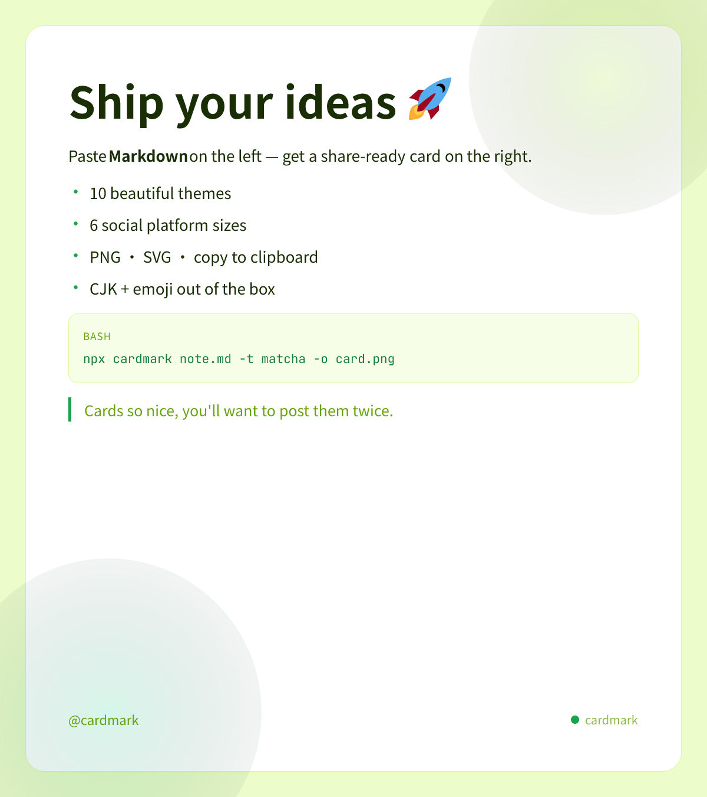
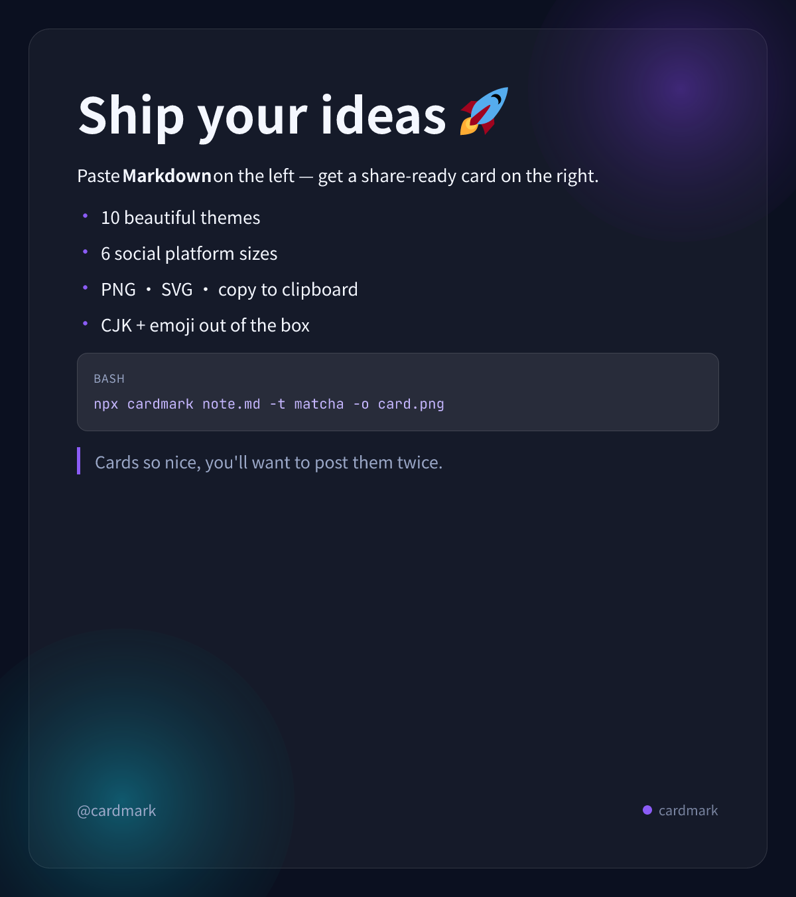
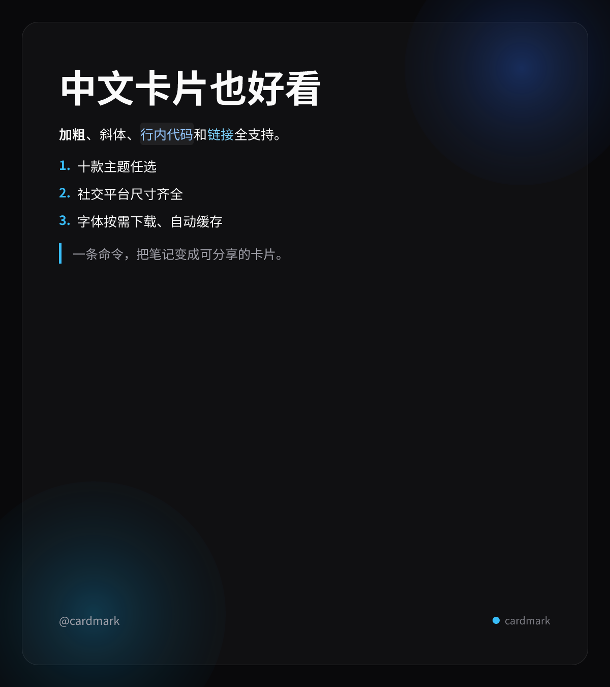
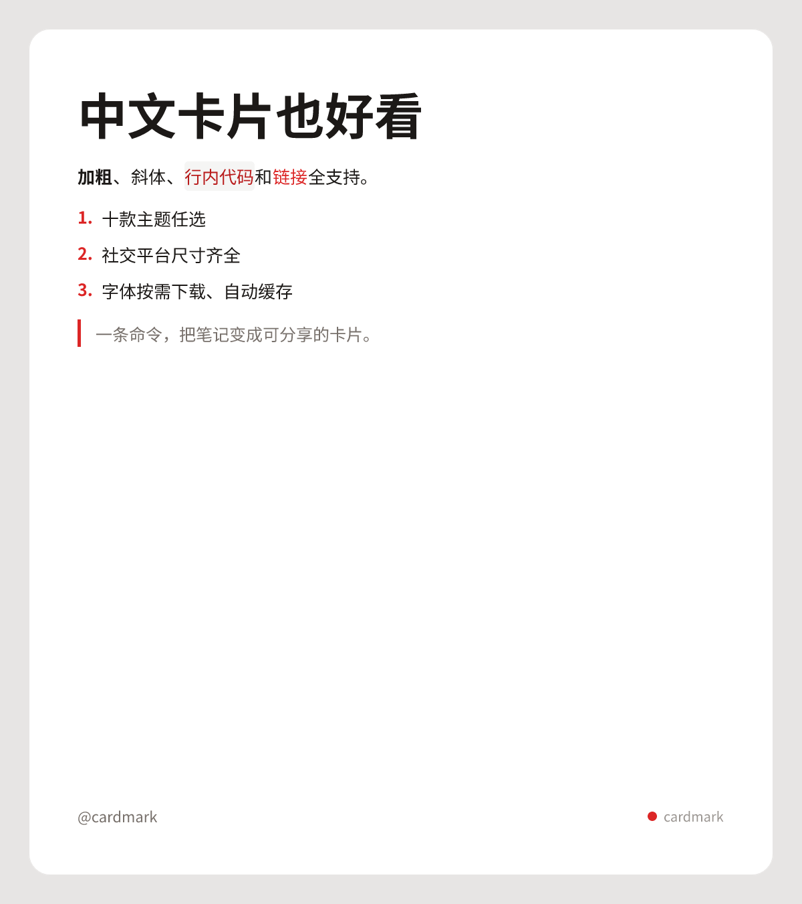
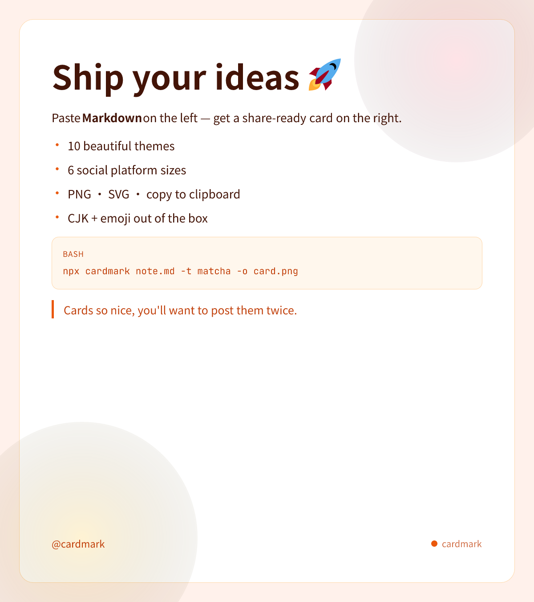
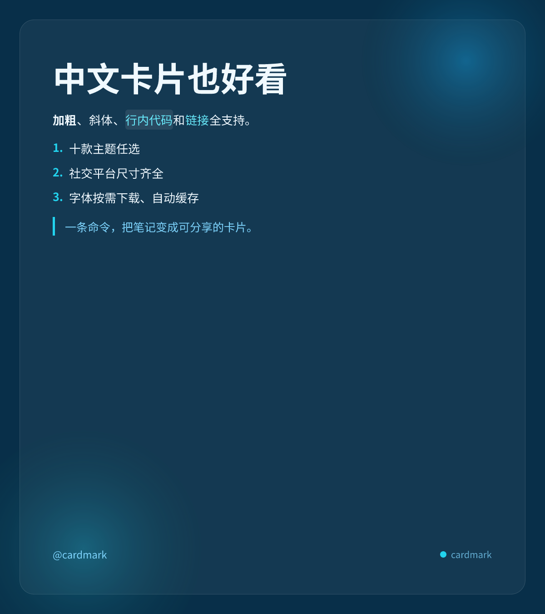
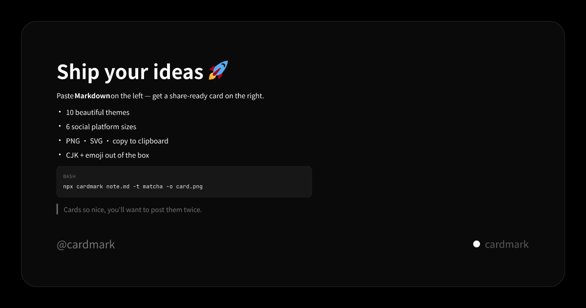
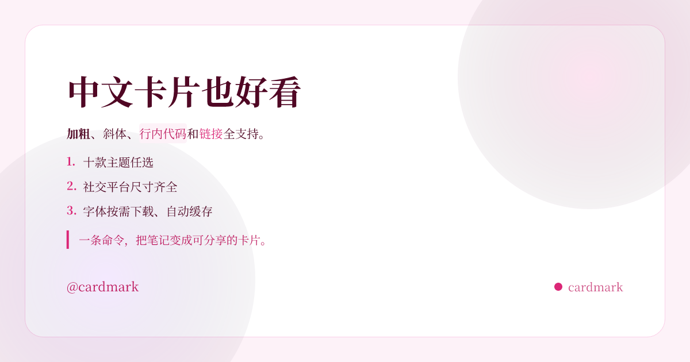
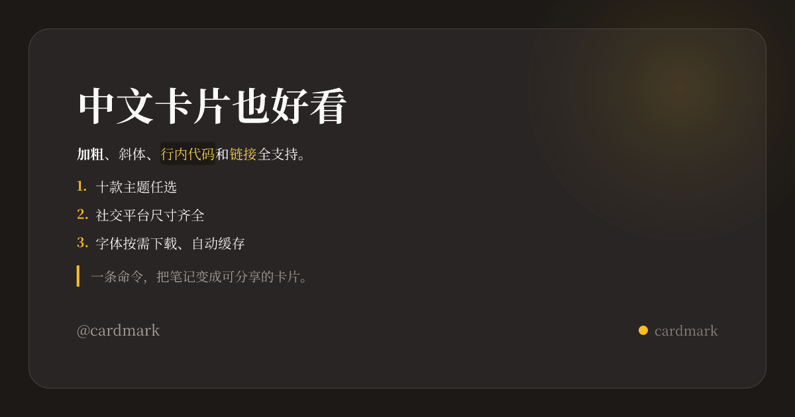

# CardMark

**Turn Markdown into beautiful shareable cards — in one command.**

CardMark renders your Markdown notes as polished social-ready images (PNG/SVG) with gorgeous themes, proper CJK typography, and emoji support. CLI, JavaScript library, and browser build in one zero-config package.

<p align="center">
  
</p>

**🚀 Try it online — no install:** [live editor on GitHub Pages](https://frankfu916.github.io/cardmark/)

## Why CardMark

Most notes die in a `.md` file. CardMark turns them into images people actually share — for Weibo/Xiaohongshu posts, X/Twitter threads, Open Graph cards, or team wikis.

- **10 hand-tuned themes** — aurora, midnight, paper, matcha, peach, noir, ocean, blossom, classic, ink
- **6 social size presets** — X post, Open Graph, square, Xiaohongshu 3:4, Instagram 4:5, Story 9:16 (or any custom `WxH`)
- **9 font sets, CJK全覆盖** — Noto Sans/Serif SC, Noto Sans/Serif JP, Noto Sans/Serif KR, JetBrains Mono, Times New Roman, Georgia, Inter; downloaded on demand and cached. Chinese, Japanese, Korean all render correctly
- **Emoji as art** — every emoji (flags, ZWJ sequences, keycaps) renders as inline Twemoji vectors, so it survives PNG export everywhere
- **Auto-fit layout** — long notes shrink to fit short formats instead of clipping
- **Split mode** — one file with `---` fences becomes a numbered card deck
- **Pure rendering** — text becomes vector paths; no headless browser, no Puppeteer, no font installation
- **Zero bloat** — the browser build (`cardmark/browser`) has no Node APIs and no native modules

## Quick start

```bash
# one-off, no install
npx cardmark note.md -t matcha -f png -o card.png

# or install globally
npm i -g cardmark
```

That's it. `note.md` → `card.png`, sized for X/Twitter by default.

### CLI

```bash
cardmark note.md [options]
cardmark < note.md > card.svg        # stdin/stdout
cardmark deck.md --split             # one card per --- fence → card-1.png, card-2.png …

Options:
  -t, --theme <name>    aurora | midnight | paper | matcha | peach | noir | ocean |
                        blossom | classic | ink            (default: aurora)
  -s, --size <preset>   x | og | square | xiaohongshu | instagram | story | 1200x900
  -f, --format <fmt>    svg | png                          (default: svg)
  -o, --out <file>      output file (stdout for svg; required for png)
  -b, --byline <text>   footer text, e.g. @yourhandle
  -p, --padding <sm|md|lg|xl>
      --split           split on --- / === fences into numbered cards
      --no-footer
  -F, --font <path>     embed an extra .ttf/.otf/.woff (repeatable)
      --font-set <name> override the theme's font set (see --list-font-sets)
      --list-themes     list themes and exit
      --list-sizes      list size presets and exit
      --list-font-sets  list font sets and exit
  -h, --help            show help
  -v, --version
```

### Library

```ts
import { renderPng, renderCard } from 'cardmark'

const png = await renderPng('# Hello 🌏\n\n中文 **and** english.', {
  theme: 'midnight', // theme id, or a partial custom theme object
  size: 'og', // preset id, or { width, height }
  byline: '@you',
})

const { svg } = await renderCard('# Hello', { theme: 'matcha' })
```

Fonts resolve automatically: the theme's font set is downloaded from pinned CDNs on
first use, then cached in `~/.cache/cardmark/fonts/` (override with
`CARDMARK_CACHE_DIR`). Offline? CardMark falls back to host system fonts.

### Font sets

Pick the typography that matches your content with `--font-set` (or `fontSet` in
`renderCard` options — it overrides the theme default):

| font set         | faces                            | good for           |
| ---------------- | -------------------------------- | ------------------ |
| `default`        | Noto Sans SC + JetBrains Mono    | 中文 (default)     |
| `serif`          | Noto Serif SC + JetBrains Mono   | 中文正文/文艺风    |
| `latin`          | Inter + Georgia + JetBrains Mono | English posts      |
| `editorial`      | Times New Roman + Noto Serif SC  | 杂志/社论风        |
| `japanese`       | Noto Sans JP + JetBrains Mono    | 日本語             |
| `japanese-serif` | Noto Serif JP + JetBrains Mono   | 日本語・明朝       |
| `korean`         | Noto Sans KR + JetBrains Mono    | 한국어             |
| `korean-serif`   | Noto Serif KR + JetBrains Mono   | 한국어·명조        |
| `cjk-all`        | SC + JP + KR together            | 混排（中日韩同屏） |

```bash
cardmark japanese.md --font-set japanese -f png -o card.png
```

### Custom themes

Any theme field can be overridden; unspecified fields inherit from `midnight`:

```ts
import { renderCard } from 'cardmark'

await renderCard(md, {
  theme: {
    id: 'brand',
    label: 'Brand',
    appearance: 'dark',
    accent: '#ff5c8a',
    cardBackground: '#1a1025',
  },
})
```

### Browser build

The `cardmark/browser` entry point is platform-neutral — no `node:` imports, no
native rasterizer — so it bundles cleanly with Vite/webpack/esbuild:

```ts
import { renderCard, loadFontSet } from 'cardmark/browser'

const fonts = await loadFontSet('default') // cached in memory after first load
const { svg } = await renderCard(md, { theme: 'ocean', fonts })
```

Rasterize to PNG by drawing the SVG onto a `<canvas>` — see
[`web/src/App.tsx`](web/src/App.tsx) for a complete working editor (~180 lines).

The editor in [`web/`](web) is a ready-to-deploy Vite app — **deployed live at
[frankfu916.github.io/cardmark](https://frankfu916.github.io/cardmark/)** — with
live preview, theme/size/font-set switchers, PNG/SVG download, and
copy-to-clipboard. It redeploys automatically on every push to `main` via
GitHub Actions (see [`pages.yml`](.github/workflows/pages.yml)).

## Theme gallery

|                                    |                                      |                                        |
| ---------------------------------- | ------------------------------------ | -------------------------------------- |
|  |    |  |
|    |      |        |
|      |  |            |

`classic` and all sizes: see [`assets/`](assets/). Regenerate everything with the
snippet in [`examples/`](examples/).

## Size presets

| preset        | px        | use for                      |
| ------------- | --------- | ---------------------------- |
| `x`           | 1200×1350 | X/Twitter image posts        |
| `og`          | 1200×630  | Open Graph / link cards      |
| `square`      | 1080×1080 | generic square posts         |
| `xiaohongshu` | 1080×1440 | 小红书 image notes           |
| `instagram`   | 1080×1350 | Instagram portrait           |
| `story`       | 1080×1920 | Stories / Reels / 短视频封面 |

Any custom size works too: `-s 1200x900`.

## How it works

```
Markdown ──marked──▶ block model ──layout──▶ satori element tree
        ──satori──▶ SVG (text as vector paths, emoji as Twemoji)
        ──resvg──▶ PNG
```

No browser, no canvas, no system font setup. The npm package ships a vendored
satori build so `npm i cardmark` pulls exactly three dependencies.

## Development

```bash
npm install
npm test          # 29 unit tests across parse/themes/render + web
npm run build     # build core (tsc + satori vendoring)
npm run dev:web   # local editor at localhost:5173
```

## Roadmap

- [x] Multi-language font sets (JP / KR / CJK-all)
- [x] Online editor (GitHub Pages)
- [ ] Syntax-highlighted code blocks
- [ ] Image embeds (``)
- [ ] GitHub Action for rendering cards in CI

## Contributing

Issues and PRs welcome. Keep PRs focused; run `npm test` and `npm run lint` first.

## License

[MIT](LICENSE)
